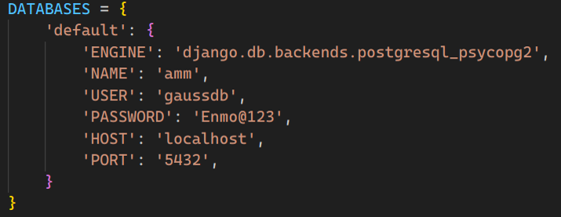

# Automotive-Maintenance-Management
Shanghai University Database principles (2) Project:

A B/S-based automobile maintenance management system developed based on the domestic database **OpenGauss**.

## Project Configuration
Environment: 
- OS : Ubuntu 23.10
- Python : 3.12.2
- Django : 3.2

### Install Docker In Your Linux
Since OpenGauss does not support Ubuntu, we chose to run it in Docker. For the installation of Docker, please refer to [Install Docker](https://blog.csdn.net/haobabiu/article/details/132892144).

Or you can enter the following command to install Docker directly.

**Old version**:
    
    sudo spt install docker.io

**New version (*Recommended*)**:

    curl -sSL https://get.docker.com/ | sh

### Pull Image Of OpenGauss
Pull the image through the following command:

    sudo docker pull enmotech/opengauss

You can use `docker images` to check whether the download is successful.
### Create Docker 
Create a container to store data persistently and map ports to provide external access.

    docker run --name opengauss -p 5432:5432 -e GS_PASSWORD=Enmo@123 --privileged=true -d enmotech/opengauss

Check docker status:

    docker ps

At this point, the image in the container is configured.

Use the database via the following mystical command:

    docker exec -it opengauss bash
    su - omm
    gsql

### Connect To Database In Django project
This step can be referred to [Connect OpenGauss](https://blog.csdn.net/weixin_45816954/article/details/121258831).

## Run Project
Configure setting.py as shown below:

The **amm** database needs to be created manually after entering opengauss through the mysterious command above.

    CREATE DATABASE amm;

Enter the following command in the terminal:

    python manage.py makemigrations
    python manage.py migrate
    python manage.py runserver
